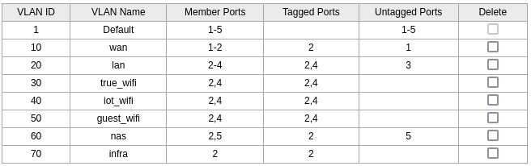

# Pi5 Router: OpenWRT, VLANs, WireGuard, Logging, TCPdumps and Total Network Control

This project demonstrates how to configure a **Raspberry Pi 5** as a secure, high-performance home router using **OpenWRT 24.10.0**. Designed for cybersecurity experimentation and network management, it replaces traditional ISP routers (e.g., NETIA's equipment) with a customizable, cost-effective solution. The setup supports a **1 Gbps ISP connection via PPPoE**, **VLAN segmentation**, **VPNs**, **network-wide ad blocking**, and **advanced logging to a NAS**, making it ideal for a home lab environment.

Skip overpriced routers. Build your own. Learn real skills. Secure your network.

[](https://opensource.org/licenses/MIT)
[](https://github.com/yourusername/raspberry-pi5-openwrt-router)

---

## Features

- **Network Segmentation**: VLANs for WAN, LAN, Trusted WiFi, IoT, Guest WiFi, NAS, and Infrastructure (e.g., Pi-hole, Home Assistant).
- **Security**: Custom firewall rules and isolated VLANs for IoT, NAS, and Guest networks to enhance security.
- **VPN**: WireGuard for secure remote access (OpenVPN support planned for future enhancements).
- **Ad Blocking**: Network-wide ad and tracker blocking using Adblock.
- **Logging**: Centralized log storage on a Seagate Personal Cloud 4TB NAS using `rsyslog` and `tcpdump` for packet captures.
- **Scalability**: Supports virtual machine labs, penetration testing, and future SIEM integration (e.g., Wazuh).

---

## Objectives

- Gain hands-on experience with network configuration and cybersecurity practices.
- Build a secure, customizable home lab with VLAN-based network segmentation.
- Create a flexible platform for VM labs, penetration testing, and network monitoring.
- Document a professional-grade project for inclusion in a cybersecurity portfolio.

---

## Hardware Requirements

- **Raspberry Pi 5**: 4GB RAM (8GB recommended for better performance).
- **Power Supply**: Official Raspberry Pi 5 USB-C adapter.
- **MicroSD Card**: SanDisk Extreme 64GB (170/80 MB/s, V30) for reliable storage.
- **Switch**: TP-Link TL-SG105E EasySmart Gigabit Switch for VLAN support.
- **Access Point**: TP-Link EAP610 AX1800 WiFi 6 for high-speed wireless connectivity.
- **NAS**: Seagate Personal Cloud 4TB (or equivalent) for centralized storage and logging.
- **Ethernet Cables**: CAT6a SFTP (3m x2, 1.5m x3) for reliable gigabit connections.
- **Optional**:
  - MicroHDMI to HDMI adapter for initial setup.
  - Raspberry Pi case with active cooling to prevent thermal throttling.
  - Card adapter for flashing the MicroSD card.

---

## Software Requirements

- **Operating System**: OpenWRT 24.10.0.

### Tools

- **WireGuard**: For secure VPN remote access.
- **Adblock**: For network-wide ad and tracker blocking.
- **iptables**: For custom firewall rules.
- **tcpdump**: For packet capture and network monitoring.
- **LuCI**: Web interface for OpenWRT configuration.
- **rsyslog**: For log forwarding to the NAS.
- **opennds**: For the guest portal (formerly known as `nodogsplash`).

---

## Project Status

This project is actively maintained and includes the following completed components:
- OpenWRT installation and VLAN configuration.
- Switch and access point setup.
- NAS integration for logging and backups.
- WireGuard VPN, Adblock, and centralized logging with `rsyslog` and `tcpdump`.
- Backup procedures for OpenWRT, switch, and access point.
- Guest portal setup using `opennds` (see `docs/portal_setup.md`).

---

## Setup Overview

### 1. Flash OpenWRT

- Download OpenWRT 24.10.0 from [openwrt.org](https://openwrt.org).
- Flash the image to the MicroSD card using Raspberry Pi Imager or `dd`.
- Edit `/etc/config/uhttpd` to add HTTP/HTTPS listeners for LuCI access (see `configs/uhttpd`).

### 2. Connect Hardware to Switch

| Port | Device             | VLANs Assigned                | Purpose                     |
|------|--------------------|-------------------------------|-----------------------------|
| 1    | Modem              | VLAN 10                       | WAN (Internet)              |
| 2    | Raspberry Pi 5     | VLAN 10, 20, 30, 40, 50, 60, 70 | Router (all VLANs)          |
| 3    | Workstation        | VLAN 20                       | LAN (PC)                    |
| 4    | TP-Link EAP610     | VLAN 20, 30, 40, 50           | Access Point (WiFi)         |
| 5    | Seagate NAS        | VLAN 60                       | Storage and logging         |


---

## VLAN Configuration on the Switch

| VLAN ID | Name           | Ports Assigned | Tagged Ports | Untagged Ports | Purpose                      |
|---------|----------------|----------------|--------------|----------------|------------------------------|
| 10      | WAN            | 1, 2           | 2            | 1              | Internet from modem          |
| 20      | LAN            | 2, 3, 4        | 2, 4         | 3              | PC and AP management         |
| 30      | Trusted WiFi   | 2, 4           | 2, 4         | -              | SSID for phones/laptops      |
| 40      | IoT WiFi       | 2, 4           | 2, 4         | -              | SSID for smart devices       |
| 50      | Guest WiFi     | 2, 4           | 2, 4         | -              | Internet-only SSID           |
| 60      | NAS            | 2, 5           | 2            | 5              | Isolated NAS storage         |
| 70      | Infrastructure | 2, 4           | 2, 4         | -              | Pi-hole, Home Assistant  Wazuh, Suricata dockers (future) |



---

## Installation Steps

Follow these steps to set up the secure router. Each step links to detailed documentation in the `docs/` directory.

### 1. Flash OpenWRT
- Download and flash OpenWRT 24.10.0, then configure `/etc/config/uhttpd` for LuCI access. ([openWRT-Setup](docs/openWRT-setup.md))

### 2. Connect Hardware
- Connect the modem, Raspberry Pi 5, workstation, access point, and NAS to the switch as outlined in the hardware table above. ([openWRT-Setup](docs/openWRT-setup.md))

### 3. Configure the Switch
- Set up VLANs on the TP-Link TL-SG105E switch ([Switch Setup](docs/switch-setup.md)).

### 4. Configure OpenWRT
- Perform initial OpenWRT setup, including password, SSH, VLANs, interfaces, PPPoE for NETIA ISP, and firewall rules ([OpenWRT Setup](docs/openWRT-setup.md)).
- Configuration files: `configs/network`, `configs/firewall`, `configs/dhcp`, `configs/uttpd`.

### 5. Set Up the Access Point
- Configure VLAN-tagged SSIDs on the TP-Link EAP610 ([Access Point Setup](docs/access_point-setup.md)).

### 6. Integrate the NAS
- Mount the Seagate NAS for storage and logging ([NAS Setup](docs/nas-setup.md), [Mount Script](docs/mount_nas_openwrts.sh)).

### 7. Enable Logging and tcpdump
- Set up centralized logging with `rsyslog` and packet capturing with `tcpdump` ([Rsyslog Setup](docs/rsyslog-setup.md), [Tcpdump Setup](docs/tcpdump-setup.md)).
- Scripts: `script/tcpdump_logger.sh`, `script/startcp.sh`.

### 8. Set Up VPN
- Configure WireGuard for secure remote access ([VPN Setup](docs/vpn-setup.md)).

### 9. Enable Ad Blocking
- Set up network-wide ad blocking with Adblock ([Adblock Setup](docs/adblock-setup.md)).

### 10. Configure Guest Portal
- Set up a guest portal using `opennds` ([Portal Setup](docs/portal_setup.md)).

### 11. Resize the MicroSD Card
- Expand the MicroSD card to use its full capacity ([Resize Setup](docs/resize_setup.md)).

### 12. Back Up Configurations
- Back up OpenWRT, switch, and access point configurations ([Backup Setup](docs/backup-setup.md)).

### 13.  Deploy Wazuh (Future)
- Deploy Suricata as a Docker container on a separate Raspberry Pi on VLAN 70 for network intrusion detection (planned).

### 14. Deploy Suricata (Future)
- Deploy Wazuh as a Docker container on a separate Raspberry Pi on VLAN 70 for SIEM and log analysis (planned).

### 15. Deploy home assistant (Future)
- Deploy home assistant on VLAN70 (planned)

---

## Usage

### Access the OpenWRT LuCI Interface
- Open a browser and navigate to `http://192.168.2.1`.
- Log in with the credentials you set during OpenWRT setup.

### Monitor Logs on the NAS
- Check centralized logs stored on the NAS:
  ```bash
  ls -lh /mnt/cloud/logs/
  ```
- Logs are organized by device (e.g., `/mnt/cloud/logs/openwrt/`, `/mnt/cloud/logs/AP/`).

### Capture Network Packets
- Start packet capturing on a specific interface (e.g., `eth0.20` for LAN):
  ```bash
  /etc/init.d/tcpdump_logger start eth0.20
  startcp eth0.20
  ```
- Captures are saved to `/mnt/cloud/tcpdumps/` (e.g., `/mnt/cloud/tcpdumps/eth0.20.pcap`).

### Connect via VPN
- Use WireGuard on your phone or laptop to connect to the VPN.
- Access the LuCI interface remotely at `http://192.168.2.1` or SSH into the router:
  ```bash
  ssh root@192.168.2.1
  ```

### Access the Guest Portal
- Connect to the Guest WiFi SSID (VLAN 50).
- Open a browser to access the `opennds` guest portal for authentication (details in [Portal Setup](docs/portal_setup.md)).

---

## Troubleshooting

- **No Internet**:
  - Verify PPPoE credentials in `/etc/config/network`.
  - Check VLAN configuration on the switch and OpenWRT.
  - Ensure firewall forwarding is enabled (LAN → WAN) in `/etc/config/firewall`.
- **Switch UI Unreachable**:
  - Use the TP-Link Easy Smart Configuration Utility (Windows) to access the TL-SG105E switch.
  - Verify VLAN 20 is correctly configured for switch management.
- **NAS Mount Fails**:
  - Check the NAS mount status:
    ```bash
    df -h | grep /mnt/cloud
    ```
  - Verify CIFS settings and `fstab` configuration ([NAS Setup](docs/nas-setup.md)).
- **MicroSD Card Not Resized**:
  - Follow the resize instructions to use the full capacity of your MicroSD card ([Resize Setup](docs/resize_setup.md)).
- **Any Problems?**:
  - something stuck after power outage first `dd` using backups   

---

## Contributing

Contributions are welcome! Please submit pull requests or open issues for improvements, bug fixes, or additional features.

---

## 📄 License

This project is licensed under the **MIT License**. See the [LICENSE](LICENSE) file for details.

---

## Acknowledgments

- **OpenWRT Community**: For excellent documentation and software support.
- **TP-Link**: For reliable networking hardware (TL-SG105E switch, EAP610 access point).
- **NETIA**: For ISP services and PPPoE authentication.

 ## **Contact Me**
 
- 📧 **Email:** [l.kedzielawski@gmail.com](mailto:l.kedzielawski@gmail.com)
- 💼 **LinkedIn:** [linkedin.com/in/lukasz-kedzielawski](https://www.linkedin.com/in/lukasz-kedzielawski/)
