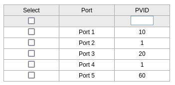

# Switch Setup for TP-Link TL-SG105E

This guide details the configuration of the TP-Link TL-SG105E EasySmart Gigabit Switch for the Raspberry Pi 5 Secure Router project. The switch is configured to support VLAN segmentation for WAN, LAN, Trusted WiFi, IoT WiFi, Guest WiFi, NAS, and Infrastructure services, enabling secure network isolation and efficient traffic management with OpenWRT.

---

## Overview

The TP-Link TL-SG105E is a 5-port managed switch used to connect:

- Modem
- Raspberry Pi 5 (OpenWRT router)
- Workstation
- Access Point
- NAS

VLANs are configured to isolate traffic for security and performance. Tagged and untagged traffic is configured per port based on device needs.

---

## Port Assignments

| Port | Connected Device       | Purpose                           |
|------|------------------------|-----------------------------------|
| 1    | Modem                  | WAN (Internet)                    |
| 2    | OpenWRT Router (Pi 5)  | Handles all VLANs (tagged traffic)|
| 3    | Workstation (PC)       | LAN (untagged VLAN 20)           |
| 4    | Access Point (EAP610)  | Trusted/IoT/Guest WiFi + mgmt    |
| 5    | NAS (Seagate 4TB)      | VLAN 60 for isolated storage     |

---

## 🌐 VLAN Configuration

| VLAN ID | Name           | Ports Assigned | Tagged Ports | Untagged Ports | Purpose                             |
|---------|----------------|----------------|--------------|----------------|-------------------------------------|
| 1       | Default        | 1-5            | -            | -              | Legacy/default (can be ignored)     |
| 10      | WAN            | 1, 2           | 2            | 1              | Internet from modem to router       |
| 20      | LAN            | 2, 3, 4        | 2, 4         | 3              | PC and AP management                |
| 30      | Trusted WiFi   | 2, 4           | 2, 4         | -              | SSID for phones/laptops             |
| 40      | IoT WiFi       | 2, 4           | 2, 4         | -              | SSID for smart devices              |
| 50      | Guest WiFi     | 2, 4           | 2, 4         | -              | Internet-only SSID                  |
| 60      | NAS            | 2, 5           | 2            | 5              | Isolated NAS storage                |
| 70      | Infrastructure | 2, 4           | 2, 4         | -              | Pi-hole, Home Assistant, Prometheus|

---

## 🧾 PVID Configuration

| Port | Connected Device  | Traffic Type        | PVID | Reason                                      |
|------|-------------------|---------------------|------|---------------------------------------------|
| 1    | Modem             | Untagged            | 10   | WAN traffic is untagged from modem          |
| 2    | OpenWRT Router    | All Tagged VLANs    | 1*   | No untagged traffic, only handles tagged    |
| 3    | Workstation (PC)  | Untagged (VLAN 20)  | 20   | PC uses LAN, untagged                       |
| 4    | Access Point      | All Tagged VLANs    | 1*   | AP sends tagged SSIDs, management is tagged |
| 5    | NAS               | Untagged (VLAN 60)  | 60   | NAS only uses VLAN 60, untagged             |

> **Note**: For Ports 2 and 4, PVID is set to `1` or left unset as they only handle **tagged traffic**.

---

## 🛠️ Setup Instructions

### 🔧 Prerequisites

- **Hardware**: TL-SG105E, Ethernet cables, Windows PC/VM
- **Software**: [TP-Link Easy Smart Configuration Utility](https://www.tp-link.com)
- **Network**: Temporary connection between switch and PC

---

### ⚙️ Steps

#### 1. Connect the Switch

- power on windows, VM is ok
- Power on the switch.
- Connect the swtich directly to your Windows PC.

#### 2. Install & Launch the Utility

- Download and install the TP-Link Easy Smart Configuration Utility.
- Launch it to detect the switch (usually at `192.168.0.1`).

#### 3. Change password 

- go to system / User Account 
- change the password

#### 4. Configure VLANs

- Go to `VLAN → 802.1Q VLAN`
- Add VLANs `10–70` using the table above
- Example: VLAN 10 (WAN) → Port 1 Untagged, Port 2 Tagged
- VLAN 1 (default) can be left as is

#### 5. Set PVIDs

- Go to `VLAN → Port VLAN`
- Use the PVID table above to assign correct PVIDs
- Confirm:
  - Port 1 → PVID 10
  - Port 2 → PVID 1 (or unset)
  - Port 3 → PVID 20
  - Port 4 → PVID 1 (or unset)
  - Port 5 → PVID 60

#### 6. Save and Reconnect

Reconnect the devices as follows:

| Port | Device              |
|------|---------------------|
| 1    | Modem               |
| 2    | Raspberry Pi 5      |
| 3    | PC (Workstation)    |
| 4    | TP-Link EAP610 AP   |
| 5    | Seagate NAS         |

#### 6. Set Static IP

- Change switch IP to `192.168.2.100`
- Set:
  - Gateway: `192.168.2.1` (your OpenWRT router)
  - DNS: `8.8.8.8`
- Save & reboot

Visit `http://192.168.2.100` to confirm settings.

---

## Testing

- Ping `192.168.2.1` (OpenWRT) and `8.8.8.8` (Google DNS) from PC
- Verify VLAN behavior and device isolation

---

## Troubleshooting

- **Switch UI unreachable on Linux**:  
  Use the TP-Link Utility on Windows or in a Windows VM with bridged adapter.

- **No connectivity after VLAN setup**:  
  Recheck VLAN and PVID settings. Ports 2 and 4 must be Tagged correctly.

- **Switch IP conflict/inaccessible**:  
  Factory reset with button (hold 5–10s) and reconfigure.

- **No Internet from VLAN 20**:  
  Check OpenWRT firewall rules: LAN → WAN forwarding, and VLAN 10 receiving from modem.

---

##  Notes

- **Tagged vs Untagged**:  
  Only Ports 2 and 4 (OpenWRT, AP) use tagged VLANs. Others use untagged for simplicity.

- **PVID Importance**:  
  Ensures correct VLAN assignment for untagged traffic.

- **Use Utility over Web UI**:  
  The utility is more reliable

